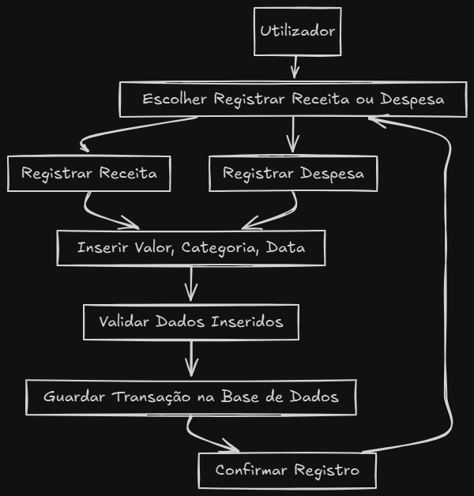
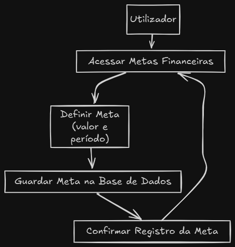
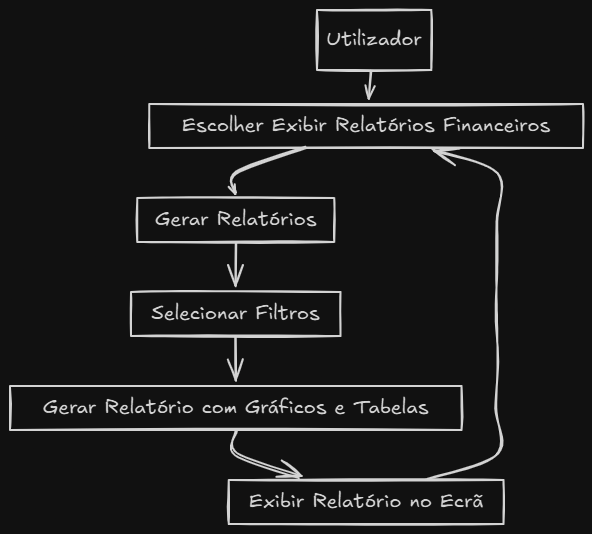
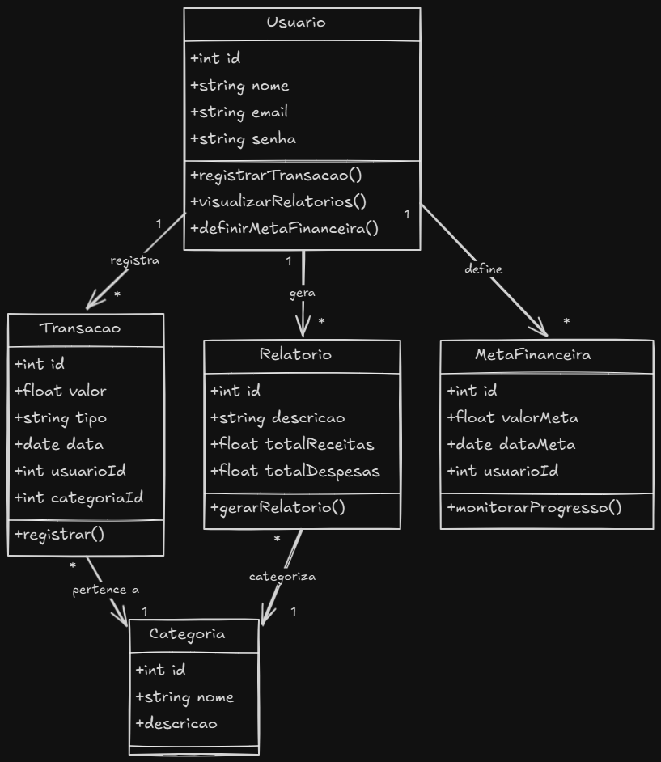

# Casos de Uso

## Registo de Receitas/Despesas

  

    1. O utilizador inicia sessão na aplicação.
    2. O utilizador navega até à secção de registo de receitas/despesas.
    3. O sistema pergunta ao utiliador se deseja registar uma receita ou despesa.
    4. O utilizador seleciona a opção desejada.
    5. O sistema apresenta um formulário para o utilizador preencher com os detalhes da receita ou despesa.
    6. O utilizador preenche o formulário com as informações necessárias (ex: valor, categoria, data).
    7. O utilizador submete o formulário.
    8. O sistema valida os dados inseridos.
    9. O sistema armazena a receita ou despesa na base de dados.
    10. O sistema confirma o registo de uma receita ou despesa com sucesso.

## Definição de Metas Financeiras

  

    1. O utilizador inicia sessão na aplicação.
    2. O utilizador navega até à secção de definição de metas financeiras.
    3. O sistema apresenta uma lista de metas financeiras existentes.
    4. O utilizador seleciona a opção de criar uma nova meta financeira.
    5. O sistema apresenta um formulário para o utilizador preencher com os detalhes da meta financeira.
    6. O utilizador preenche o formulário com as informações necessárias (ex: valor, prazo, categoria).
    7. O utilizador submete o formulário.
    8. O sistema valida os dados inseridos.
    9. O sistema armazena a meta financeira na base de dados.
    10. O sistema confirma a criação da meta financeira com sucesso.

## Exibição de Relatórios Financeiros

  

    1. O utilizador inicia sessão na aplicação.
    2. O utilizador navega até à secção de relatórios financeiros.
    3. O sistema apresenta uma lista de relatórios financeiros disponíveis.
    4. O utilizador seleciona o relatório que deseja visualizar.
    5. O sistema gera o relatório com base nos dados armazenados na base de dados.
    6. O sistema apresenta o relatório ao utilizador.

  ## Troca de Contas

    1. O utilizador inicia sessão na aplicação.
    2. O utilizador navega até à secção de metas financeiras.
    3. O sistema apresenta uma lista das contas poupança.
    4. O utilizador seleciona uma conta poupança para visualizar.
    5. O sistema apresenta a nova conta poupança.
    6. O utilizador volta á página inicial onde visualiza a sua conta corrente.

# Modelo de Domínio

  
